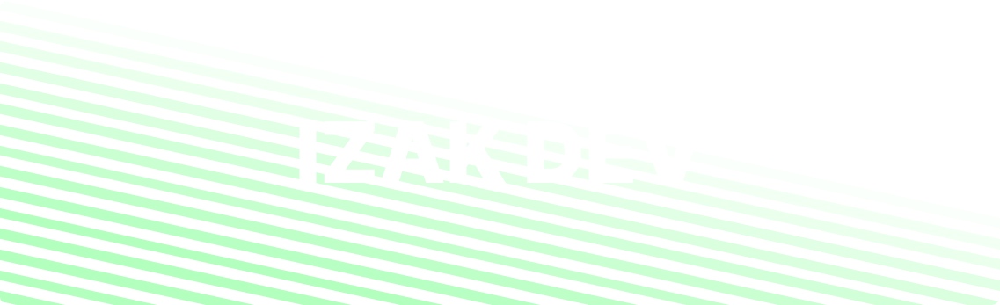

<h1 align="center">Hi 👋, I'm Izak !</h1>

I'm a FullStack developper who started to code at 12 or 11 i forgor 💀. I started with Batch & HTML, and a bit later I learned Python. I was passionated about obfuscation so I started to make my obfuscators, and a friend wanted to collaborate with me to create more powerfull obfuscators, we built one of the most 100% Python obfuscator. Later, I learned React, then Svelte, then NextJS.

## My mostly used languages

## Tools that I use

## Projects
- [SeeFrench](https://seefrench.pro): A French streaming website with Movies, Series, and Animes. All that for free **(non-open-source)**

- [Lynxx](https://pypi.org/project/lynxx): A Python package like [PyStyle](https://github.com/billythegoat356/PyStyle) but more full, customizable, fast, with way more features. The project was meant to be PyStyle V2. But it was canceled.

- [StoreJSON](https://pypi.org/project/storejson): A Python module that is the easiest way to Store JSON typed data using a Pydantic models and database-like structure.
